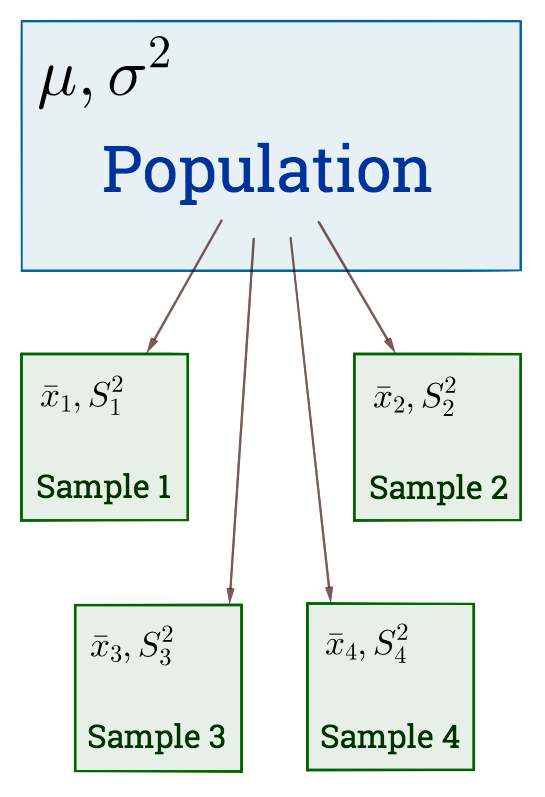

```{r setup, include=FALSE}
options(htmltools.dir.version = FALSE, digits = 3, signif = 999)
knitr::opts_chunk$set(echo = FALSE, comment = NULL)
library(mixlm)
library(tidyverse)
library(gganimate)
```
```{r load-function, include=FALSE}
get_fplot <- function(alpha, deg.freedom, max_limit, fvalue = NULL) {
d <- deg.freedom
lmt <- max_limit
plt <- ggplot(data.frame(x = 0:lmt), aes(x)) +
  stat_function(fun = df, args = list(df1 = d[1], df2 = d[2]), n = 200) +
  stat_function(fun = df, args = list(df1 = d[1], df2 = d[2]), n = 200, 
                xlim = c(qf(alpha, df1 = d[1], df2 = d[2], lower.tail = FALSE), lmt), 
                geom = "area") +
  ggtitle(paste("F-distribution with", paste(d, collapse = " and "), "df"),
          paste(alpha, "level of significance")) +
  labs(x = "F", y = NULL) +
  annotate(x = qf(alpha, df1 = d[1], df2 = d[2], lower.tail = FALSE),
           color = "red",
           ymin = 0, ymax = 0.1, geom = "linerange") +
  annotate(x = qf(alpha, df1 = d[1], df2 = d[2], lower.tail = FALSE),
           label = paste("F =", round(qf(alpha, df1 = d[1], df2 = d[2], lower.tail = FALSE), 3)), 
           geom = "text", y = 0.15, hjust = 0)
if (!is.null(fvalue)){
  plt <- plt +
    annotate(x = fvalue, y = 0, geom = "point", color = "red") +
    annotate(x = fvalue, y = 0, geom = "text", label = paste("F0:", round(fvalue, 3)), hjust = 1.2)
}
return(plt)
}
```


background-image: url(https://www.nmbu.no/sites/all/themes/nmbu_university/images/logo-nb.png)

???

Image credit: [NMBU](https://www.nmbu.no/sites/all/themes/nmbu_university/images/logo-nb.png)

---
class: center, middle, inverse

# Statistical Inference
## Hypothesis Testing

---

.left-column[
# Inference Steps

```{r, out.width='100%'}

```

]
.right-column[

### Steps

1. Make a hypothesis

2. Collect data

3. Calculate test-statistic

4. Compare test-statistic with theoretical distribution </br>(T-statistic, F-statistic, $\chi^2$ statistic)

5. Conclusion and decision

### Remember

For an estimate we always use .red[hat]. For instance, Sample mean $\bar{x} = \hat{\mu}$ is an estimate of population mean $\mu$.

Similarly, $\hat{\sigma}$ is an estimate of population standard deviation $\sigma$.

]

---
class: spread

.left-column[
# Hypothesis
## Null Hypothesis

### Exam questions
- <a href="images/2011-1.png" data-fancybox >2011: 2(a)</a>
- <a href="images/2012-1.png" data-fancybox >2012: 2(b)</a>
]

.right-column[
### Use cases

One sample t-test
: $H_0: \mu = 5$

Two sample t-test
: $H_0: \mu_1 = \mu_2$

ANOVA model
: $H_0: \tau_1 = \tau_2 = \tau_3 = 0$

Random effect Model
: $H_0: \sigma_\tau^2 = 0$

.red[_Always write hypothesis in terms of **population parameter**_]
]

---
class: spread

.left-column[
# Hypothesis
## Alternative Hypothesis

### Exam questions
- <a href="images/2011-1.png" data-fancybox >2011: 2(a)</a>
- <a href="images/2012-1.png" data-fancybox >2012: 2(b)</a>
]

.right-column[

### One sided vs Two sided

<details>
<summary>Test if expected variance of \(x\) is greater than 11.</summary>
\[H_1: \sigma > 11\]
</details>

<details>
<summary>Are the three soya groups significantly different?</summary>
\[H_1: \mu_i \ne \mu_j \text{ for any } i \ne j\]
If \(\tau_i = \mu_i - \mu\) is the effect of group \(i\),
\[H_1: \tau_i \ne 0 \text{ for at least one } i = 1, 2, 3\]
</details>

<details>
<summary>Can we conclude that the average of `soya` diet gives higher protein than `non-soya` diet?</summary>
\[H_1: \Gamma < 0 \text{ where, } \Gamma = \tau_1 - \frac{1}{2}(\tau_2 + \tau_3)\]
</details>

<details>
<summary>Does fat percent vary accross these randomly chosen farms?</summary>
\[H_1: \sigma_\tau^2 > 0\]
</details>
]

---

.left-column[
# T Statistic
## T-test

```{r, echo = FALSE, fig.width=4, out.width='100%', fig.asp=0.7, fig.retina=2}
d <- 18
alpha <- 0.025
lmt <- 4
t_plot <- ggplot(data.frame(x = -lmt:lmt), aes(x)) +
  stat_function(fun = dt, args = list(df = d)) +
  stat_function(fun = dt, args = list(df = d), 
                xlim = c(-lmt, qt(alpha, df = d, FALSE)), 
                geom = "area") +
  stat_function(fun = dt, args = list(df = d), 
                xlim = c(-1 * qt(alpha, df = d, FALSE), lmt), 
                geom = "area") +
  stat_function(fun = dt, args = list(df = d), 
                xlim = c(-1 * qt(alpha, df = d, FALSE), lmt)) +
  ggtitle(paste("T-distribution with", d, 
                "df"),
          paste(alpha * 2, "level of significance")) +
  labs(x = "T", y = NULL) +
  annotate(x = c(1, -1) * qt(alpha, df = d, FALSE), 
           color = "red",
           ymin = 0, ymax = 0.07, geom = "linerange") +
  annotate(x = c(1, -1) * qt(alpha, df = d, FALSE), 
           label = paste("t = ", c(1, -1) * round(qt(alpha, df = d, FALSE), 3)), geom = "text", y = 0.08, hjust = c(1, 0))
```

```{r, fig.width=3.5, out.width='90%', fig.asp = 1, fig.retina=2}
t_plot
```

<div class="side-caption">The .italics[darker region] under the curve is .italics[rejection region]. If the calculated t-value lies in this region, we reject Null hypothesis.</div>
]

.right-column[

### One sample mean
$$\text{t-statistic} = \dfrac{\bar{y}}{\mathrm{SE}(\bar{y})} = \dfrac{\bar{y}}{\hat{\sigma}/\sqrt{n}} \sim t_{\alpha/2, n-1}$$
### Difference between two groups 
$$\text{t-statistic} = \dfrac{\bar{y}_i - \bar{y}_j}{\mathrm{SE}(\bar{y}_i - \bar{y}_j)} = \dfrac{\bar{y}_i - \bar{y}_j}{S_\text{pooled}\sqrt{\cfrac{1}{n_1} + \cfrac{1}{n_2}}} \sim t_{\alpha/2, N-a}$$
### C.I. true difference between two groups
$$\left[\bar{y}_i - \bar{y}_j \pm t_{\alpha/2, N-a} \times S_\text{pooled}\sqrt{\cfrac{1}{n_1} + \cfrac{1}{n_2}} \right]$$

**Remember:** Here $N = n_1 + n_2$ is total number of observation in all groups.
]


---

.left-column[
# T Statistic
## Example
```{r, fig.width=3, out.width='90%', fig.asp = 1, fig.retina=2}
load("../_data/Portlandcement.RData")
cement <- gather(Portlandcement)
plt <- cement %>% 
  ggplot(aes(key, value)) +
  geom_boxplot() +
  stat_summary(fun.y = mean, geom = "point", shape = 4, color = "red") +
  coord_flip() +
  labs(x = NULL, y = 'Strength') +
  theme(axis.text.y.left = element_text(angle = 90, hjust = 0.5))
plt
```
```{r}
head(Portlandcement, 2)
```
]
.right-column[
### Two sample t-test

```{r}
with(Portlandcement, mixlm::t_test(Modified, Unmodified, var.equal = TRUE))
```

### ANOVA test
```{r}
mdl <- mixlm::lm(value ~ key, data = cement)
mixlm::anova_reg(mdl)
```

<h3><a href="javascript:;" data-fancybox data-src="#hidden-content">Pooled Variance</a></h3>

.hidden[
<div id="hidden-content">
<h3>Pooled Variance</h3>
Pooled Variance \((S_\text{pooled}^2)\) is same as MSE in Anova. We can calculate it as,
\[S_\text{pooled}^2 = \frac{(n_1 - 1)S_1^2 + (n_2 - 1)S_2^2}{n_1 + n_2 - 2}\]
</div>
]
]

---

.left-column[
# $\chi^2$ Statistic
## Chisq Test

```{r, echo = FALSE, fig.width=4, out.width='100%', fig.asp=0.7, fig.retina=2}
d <- 18
alpha <- 0.025
lmt <- 50
chisq_plot <- ggplot(data.frame(x = 0:lmt), aes(x)) +
  stat_function(fun = dchisq, args = list(df = d)) +
  stat_function(fun = dchisq, args = list(df = d),
                xlim = c(0, qchisq(alpha, df = d, 
                                   lower.tail = TRUE)), 
                geom = "area") +
  stat_function(fun = dchisq, args = list(df = d),
                xlim = c(qchisq(alpha, df = d, 
                                lower.tail = FALSE), lmt), 
                geom = "area") +
  ggtitle(paste("Chisq-dist with", d, 
                "degree of freedom"),
          paste(alpha * 2, "level of significance")) +
  labs(x = "Chisq", y = NULL) +
  annotate(x = c(qchisq(alpha, df = d, lower.tail = FALSE), 
                 qchisq(alpha, df = d, lower.tail = TRUE)), 
           color = "red",
           ymin = 0, ymax = 0.025, geom = "linerange") +
  annotate(x = c(qchisq(alpha, df = d, lower.tail = FALSE), 
                 qchisq(alpha, df = d, lower.tail = TRUE)), 
           label = round(c(qchisq(alpha, df = d, lower.tail = FALSE),
                     qchisq(alpha, df = d, lower.tail = TRUE)), 3), 
                     geom = "text", y = 0.03, hjust = c(0, 1))
```
```{r, fig.width=3.5, out.width='90%', fig.asp = 1, fig.retina=2}
chisq_plot
```

<div class = "side-caption">
The shaded region covers .italics[5%] area of the curve.
</div>

]

.right-column[
### Variance Test
$$\chi^2\text{ statistic } = \frac{(n-1)S^2}{\sigma^2} \sim \chi^2_{\alpha, n-1}$$

### ANOVA: Confidence Interval of MSE $(\hat{\sigma}^2)$

$$\left[\dfrac{(N-a)\text{MSE}}{\chi^2_{\alpha/2, N-a}}, \dfrac{(N-a)\text{MSE}}{\chi^2_{1-\alpha/2, N-a}}\right] =
\left[\dfrac{\text{SSE}}{\chi^2_{\alpha/2, N-a}}, \dfrac{\text{SSE}}{\chi^2_{1-\alpha/2, N-a}}\right]$$

### Things to remember
- $(N-a)$ is the degree of freedom for residual
- $(N-a)\text{MSE} = \text{SSE}$
- $\chi^2_{N-a}$ is unsymmetric unlike t-distribution

]

---

.left-column[
# F Statistic
## F test
```{r, echo = FALSE, fig.width=4, out.width='100%', fig.asp=0.7, fig.retina=2}
d <- c(3, 15)
alpha <- 0.05
lmt <- 10
f_plot <- ggplot(data.frame(x = 0:lmt), aes(x)) +
  stat_function(fun = df, args = list(df1 = d[1], df2 = d[2]), n = 200) +
  stat_function(fun = df, args = list(df1 = d[1], df2 = d[2]), n = 200, 
                xlim = c(qf(alpha, df1 = d[1], df2 = d[2], lower.tail = FALSE), lmt), 
                geom = "area") +
  ggtitle(paste("F-distribution with", paste(d, collapse = " and "), "df"),
          paste(alpha, "level of significance")) +
  labs(x = "F", y = NULL) +
  annotate(x = qf(alpha, df1 = d[1], df2 = d[2], lower.tail = FALSE),
           color = "red",
           ymin = 0, ymax = 0.1, geom = "linerange") +
  annotate(x = qf(alpha, df1 = d[1], df2 = d[2], lower.tail = FALSE),
           label = paste("F =", round(qf(alpha, df1 = d[1], df2 = d[2], lower.tail = FALSE), 3)), 
           geom = "text", y = 0.15, hjust = 0)
```
```{r, fig.width=3.5, out.width='90%', fig.asp = 1, fig.retina=2}
f_plot
```
<div class = "side-caption">
The ratio of two chisq distribution is F-distribution
</div>
]

.right-column[
### Testing difference in variablility of two groups
$$H_0: \sigma_1^2 = \sigma_2^2 \text{ vs } H_1: \sigma_1^2 \ne \sigma_2^2$$
### F statistic
If $S_1^2 \sim \chi^2_{n_1 - 1}$ and $S_2^2 \sim \chi^2_{n_2 - 1}$ are sample mean of two groups respectively,
$$F = \frac{S_1^2}{S_2^2} \sim F_{n_1-1, n_2 - 1}$$
### Secret Trick
$$F_{(1-\alpha), n_1, n_2} = \frac{1}{F_{\alpha, n_2, n_1}}$$
]

---

.left-column[
# F Statistic
## Example

```{r}
load("../_data/svin.RData")
```

```{r, fig.width=3, out.width='90%', fig.asp = 1, fig.retina=2}
soya_plot <- soya %>% 
  ggplot(aes(group, slaktevekt)) +
  geom_boxplot() +
  stat_summary(fun.y = mean, geom = "point", shape = 4, color = "red") +
  coord_flip() +
  labs(x = NULL, y = 'Strength') +
  theme(axis.text.y.left = element_text(angle = 90, hjust = 0.5))
soya_plot
```

```{r}
soya_sumry <- soya %>% 
    group_by(group) %>% 
    summarise(
        mean = mean(slaktevekt),
        var = var(slaktevekt),
        n = n()
    ) %>% as.data.frame()
print(soya_sumry, row.names = FALSE, digits = 4)
```
]

.right-column[
### Soya diet experiment
$$\text{F-value} = \frac{S_1^2}{S_2^2} = \frac{`r soya_sumry[2, 3]`}{`r soya_sumry[1, 3]`} = `r soya_sumry[2, 3]/soya_sumry[1, 3]` \sim F_{`r soya_sumry[, 4] - 1`}$$

F-value from <a href="images/F0.05.png" data-fancybox >Table</a> is `r round(qf(0.05, soya_sumry[2, 4] - 1, soya_sumry[1, 4] - 1, lower = FALSE), 4)`

```{r, fig.width = 5, out.width = '80%', fig.asp = 0.5, fig.retina = 2, fig.align = "center"}

get_fplot <- function(alpha, deg.freedom, max_limit, fvalue) {
d <- deg.freedom
lmt <- max_limit
ggplot(data.frame(x = 0:lmt), aes(x)) +
  stat_function(fun = df, args = list(df1 = d[1], df2 = d[2]), n = 200) +
  stat_function(fun = df, args = list(df1 = d[1], df2 = d[2]), n = 200, 
                xlim = c(qf(alpha, df1 = d[1], df2 = d[2], lower.tail = FALSE), lmt), 
                geom = "area") +
  ggtitle(paste("F-distribution with", paste(d, collapse = " and "), "df"),
          paste(alpha, "level of significance")) +
  labs(x = "F", y = NULL) +
  annotate(x = qf(alpha, df1 = d[1], df2 = d[2], lower.tail = FALSE),
           color = "red",
           ymin = 0, ymax = 0.1, geom = "linerange") +
  annotate(x = qf(alpha, df1 = d[1], df2 = d[2], lower.tail = FALSE),
           label = paste("F =", round(qf(alpha, df1 = d[1], df2 = d[2], lower.tail = FALSE), 3)), 
           geom = "text", y = 0.15, hjust = 0) +
  annotate(x = fvalue, y = 0, geom = "point", color = "red") +
  annotate(x = fvalue, y = 0, geom = "text", label = paste("F0:", round(fvalue, 3)), hjust = 1.2)
}

fvalue <- soya_sumry[2, 3]/soya_sumry[1, 3]
get_fplot(0.05, c(7, 8), 10, fvalue)
```

Reject $H_0$: Variation between two groups significantly differs.
]

---
class: center, middle, inverse

# ANOVA Model
---

.left-column[
# ANOVA Model
## Assumptions
```{r}
load("../_data/Exam2013.RData")
```
```{r, fig.width=3, out.width='90%', fig.asp = 1, fig.retina=2}
bwt_plot <- x2013 %>% 
  ggplot(aes(Weight1, Weight2)) +
  geom_boxplot() +
  geom_point(fill = "grey", shape = 21) +
  stat_summary(fun.y = mean, geom = "point", shape = 15, color = "red", size = 3) +
  coord_flip() +
  labs(x = "Weight of First Child", y = 'Weight of Second Child') +
  theme(axis.text.y.left = element_text(angle = 90, hjust = 0.5)) +
  stat_summary(aes(x = 2), fun.y = mean, 
               geom = "point", shape = 15, color = "blue", size = 3)
bwt_plot
```

<div class="side-caption">
<ol>
<li>Errors are random and independent</li>
<li>Errors are normally distributed with mean 0 and constant variance \(\sigma^2\)</li>
</ol>
</div>
]
.right-column[
### Mean Model
$$y_{ij} = \mu_i + \varepsilon_{ij}$$
Here,
$\mu_i$ is mean of group $i$; $i = 1, 2, \ldots a$ and $j = 1, \ldots n$

### Effect Model
$$y_{ij} = \mu + \tau_i + \varepsilon_{ij}$$
Here,
We split $\mu_i$ (group mean) into overall mean $(\mu)$ and effect $(\tau_i)$ of group $i$ as, $\mu_i = \mu + \tau_i$. In this case we will have $\sum_{i = 1}^a{\tau_i} = 0$, i.e, $\tau_1 + \tau_2 + \tau_3 = 0$

### Assumptions
In ANVOA model, we assume $\varepsilon_{ij} \sim \mathrm{NID}(0, \sigma^2)$
]

---

.left-column[
# ANOVA Model
## ANOVA table

```{r, fig.width=3, out.width='90%', fig.asp = 1, fig.retina=2}
bwt_plot
```

```{r}
mdl <- lm(Weight2~Weight1, data = x2013)
aov_tbl <- anova(mdl)
aov_tbl[, 1:4]
```
]
.right-column[
```{r, out.width="80%", fig.align="center"}

```


.left-40-column[
#### Hypothesis

\begin{aligned}
H_0: \tau_i &= 0 \text{ for i = 1, 2, 3} \\
H_1: \tau_i &\ne 0 \text{ for at least one }i
\end{aligned}

#### Decision
From <a href="images/F005-2.png" data-fancybox>F-table</a>, $F_0 > F_c$. So we reject $H_0$ at 95% confidence level.

]
.right-60-column[
```{r, fig.width = 4, out.width = '90%', fig.asp = 0.75, fig.retina = 2, fig.align = "right"}
wt <- `names<-`(reshape2::dcast(x2013, Weight1~., fun.aggregate = list, value.var = "Weight2"), c("Weight1", "Weight2"))
wt_sumry <- wt %>% 
    group_by(Weight1) %>% 
    summarize(
        mean = map_dbl(Weight2, mean),
        var = map_dbl(Weight2, var),
        n = map_dbl(Weight2, length)
    )

get_fplot(0.05, c(aov_tbl[1, 1], aov_tbl[2, 1]), 15, aov_tbl[1, 4]) +
    annotate(geom = "text", 
      x = Inf, y = Inf, 
      label = paste(capture.output(as.data.frame(wt_sumry)), 
      collapse = "\n"), 
      hjust = 1, vjust = 1,
      family = "mono")
```
]
]

---

class: inverse, center, middle

# Exam Questions

---
.left-column[
# ANOVA Model
## Exam Questions
- <a href="images/2012-2b-question.png" data-fancybox="gallery">2012:</a>
<a href="images/2012-2bcd.png" data-fancybox = "gallery">2(b), 2(c)</a>
- <a href="images/2012-appendix-45.png" data-fancybox="gallery">2012: Appendix 4-5</a>
]
.right-column[

### Question 2(b)
**Hypothesis:**
\begin{aligned}
H_0 &:\tau_1 = \tau_2 = \tau_3 = 0 \\
H_1 &:\text{At least one }\tau_i \ne 0, i = 1, 2, 3
\end{aligned}

We have p-value in ANOVA table given in Appendix 4. 
**If p-value is _less than_ the level of significance $\alpha$, we reject $H_0$**

### Question 2(c)
Since, $\mu_i = \mu + \tau_i$. All group means $\mu_1, \mu_2, \mu_3$ and overall mean $\mu$ are given, you can find $\tau_1, \tau_2$ and $\tau_3$.
]
